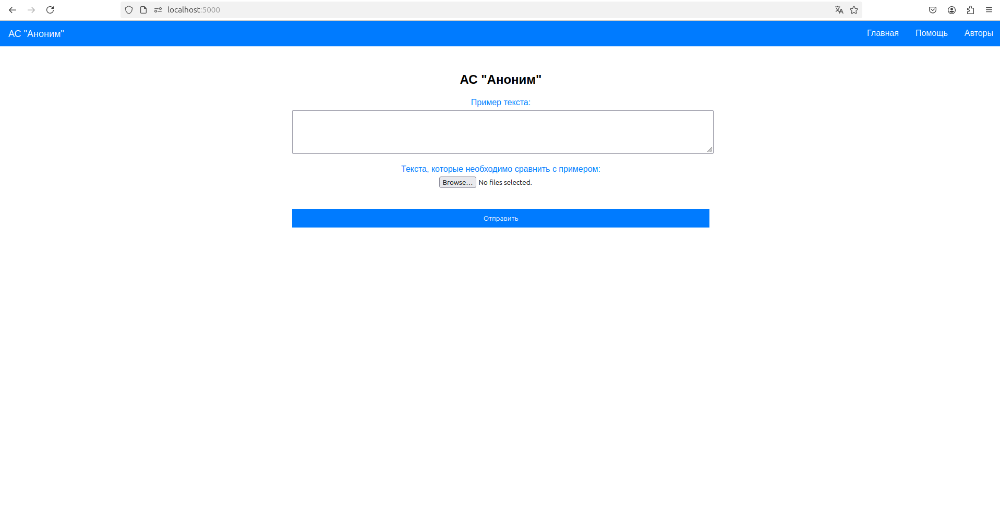

# Диплом по сравнению авторства текстов

### Для запуска приложения необходимо ввести следующие команды:
1. `docker build -t los_diplom .`
2. `docker run -p 5000:5000 los_diplom`
   
### Далее по адресу ```localhost:5000``` вставляйте пример текста и выбирайте необходимое количество .txt файлов с текстом для сравнения.

### Главная страница:
